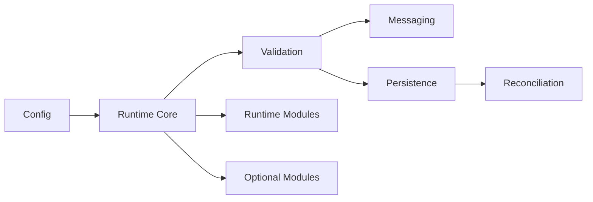

<p align="left">
  
</p>

# Wilder Cosmos - A Runtime Foundation

Wilder Cosmos Runtime is a Nim-based runtime for deterministic world-state
execution, boundary validation, structured messaging, and layered
reconciliation.

This repository is the development home for the runtime itself. It combines
  unit/
  integration/
  uat/
the implementation, the requirements and specification documents that define
correctness, and the tests used to verify progress.
  proto/
scripts/
  dev/
  build/
  verify/
  ops/
templates/
**Version:** 0.1.0

Contact: [teamwilder@wildercode.org](mailto:teamwilder@wildercode.org)

## Architecture At A Glance



At a high level, the runtime loads typed configuration, brings up the core
lifecycle, validates data at boundaries, routes messages, reconciles
persistence layers, and then opens the module surface.

## What It Is

Wilder Cosmos Runtime is designed to support systems that need:

- deterministic startup and lifecycle sequencing
- fail-fast validation at public boundaries
- structured message envelopes and transport abstraction
- multi-layer persistence with reconciliation on load and recovery
- explicit module boundaries and typed runtime APIs

The project is guided by a requirements-first workflow. The runtime behavior is
defined in the documentation before it is considered complete in code.

## Project Status

The project is in active development.

Current implemented foundations include:

- public runtime API types and validation helpers
- runtime configuration loading and validation
- JSON and Protobuf-oriented serialization foundations
- message envelope dispatch and validation
- validation prefilter foundations
- runtime lifecycle scaffolding for startup sequencing

Planned and expanding areas include deeper persistence behavior, broader
integration coverage, startup enforcement, and release hardening.

## Why This Repository Exists

This repository keeps the code and the governing documents in one place so the
runtime can be developed with traceable intent.

It includes:

- source code for runtime and cosmos modules
- verification tests and harnesses
- requirements, plans, and implementation notes
- scripts for compliance checks and scaffolding
- examples and templates for new modules

## Quick Start

### Single Entry Point
Cosmos uses a single, stable entry point for all operations: the `cosmos` CLI.

**Starting the Runtime:**
The runtime operates as a long-running daemon. To start or attach to it:
```bash
cosmos start
```

**Git-Style CLI Grammar:**
Cosmos uses an explicit, composable command structure: `cosmos <verb> [noun] [args]`
- **Daemon:** `cosmos start`, `cosmos stop`, `cosmos restart`
- **Watch Management:** `cosmos add watch /path/to/app`, `cosmos list watch`
- **Thing Management:** `cosmos add thing screenkeys.cosmos`, `cosmos list things`
- **Introspection:** `cosmos inspect world`, `cosmos console`
- **Mode Switching:** `cosmos mode step`, `cosmos mode aware`

### Prerequisites

Install:

- Nim 1.6 or newer
- Nimble
- PowerShell for the repository scripts on Windows

### Common Commands

Build and run the compliance gate:

```powershell
nimble buildRuntime
```

Run compliance checks only:

```powershell
nimble compliance
```

Compile-check the test suites:

```powershell
nimble testCompile
```

Run tests:

```powershell
nimble test
```

Run the full verification flow:

```powershell
nimble verify
```

Build and stage release artifacts locally:

```powershell
nimble releaseArtifacts
```

## Binary Distribution Safety

To reduce platform trust and policy risk, this repository does not place direct `.exe`
download links in primary documentation.

Use this release pattern instead:

1. Publish artifacts through GitHub Releases.
2. Include checksum evidence (`SHA256SUMS`) for every release.
3. Include a release summary (`RELEASE-SUMMARY.md`) for traceability.
4. If signing secrets are configured, include signature evidence (`SHA256SUMS.sig`).

Verification examples:

```powershell
# Windows PowerShell checksum verification
Get-FileHash .\cosmos-windows-amd64.exe -Algorithm SHA256
```

```bash
# Linux/macOS checksum verification
sha256sum cosmos-linux-amd64
```

Release notes should use the safe template at:

- `.github/release_notes_template.md`

## CI/CD

- GitHub CI: `.github/workflows/ci.yml` runs compile/test gates on pushes and pull requests to `main`.
- GitHub pre-release verify: `.github/workflows/pre_release_verify.yml` runs compliance and verify gates on push/PR and manual dispatch.
- GitHub release matrix: `.github/workflows/release_artifacts.yml` runs on `v*` tags and manual dispatch; it builds cross-platform artifacts, verifies checksums, and publishes a GitHub Release.
- GitHub release promotion: `.github/workflows/promote_release.yml` promotes a preview release tag to a stable tag and republishes assets with promotion notes.
- GitHub CD fallback: `.github/workflows/cd_release.yml` is a manual Windows-only fallback staging workflow.
- Codeberg CI/CD: `.woodpecker.yml` provides:
  - push/pull-request CI for `main`
  - tag-driven `v*` release staging (Linux artifact generation and dist packaging)
- Release operator playbook: `docs/public/runtime/release-tooling-guide.md`

## Repository Map

```text
src/
  cosmos/
  examples/
  modules/
  runtime/
  runtime_modules/
  style_templates/

tests/
docs/
config/
proto/
scripts/
examples/
templates/
```

Useful starting points:

- `src/runtime/api.nim`
- `src/runtime/config.nim`
- `src/runtime/validation.nim`
- `src/runtime/serialization.nim`
- `src/runtime/messaging.nim`
- `src/runtime/persistence.nim`
- `src/runtime/core.nim`

## Documentation

If you are approaching the project for the first time, start with:

- [docs/index.md](docs/index.md)
- [docs/public/index.md](docs/public/index.md)
- [docs/implementation/REQUIREMENTS.md](docs/implementation/REQUIREMENTS.md)
- [docs/implementation/SPECIFICATION-NIM.md](docs/implementation/SPECIFICATION-NIM.md)
- [docs/implementation/PLAN.md](docs/implementation/PLAN.md)
- [docs/implementation/IMPLEMENTATION-DETAILS.md](docs/implementation/IMPLEMENTATION-DETAILS.md)
- [docs/implementation/DEVELOPMENT-GUIDELINES.md](docs/implementation/DEVELOPMENT-GUIDELINES.md)
- [docs/implementation/MODULES.md](docs/implementation/MODULES.md)
- [Application Developer Getting Started Guide](getting-started/app-developer-guide.md)

## Development Workflow

The standard repository workflow is:

1. Read the affected requirement sections.
2. Update compliance mappings when requirements change.
3. Implement code changes.
4. Add or update tests.
5. Run verification commands.
6. Record evidence in the pull request.

The compliance gate script is located at
`scripts/verify/check_requirements.ps1`.

## Module Scaffolding

Header templates live under `templates/headers/`.

To generate a new Nim module with the expected project header structure, use:

```powershell
powershell -NoProfile -ExecutionPolicy Bypass -File scripts/dev/new_nim_module.ps1 -Kind runtime -Name API -RelativePath src/runtime/api.nim -Summary "Public runtime API types and input validation framework." -Simile "API is the contract between modules and the runtime." -MemoryNote "All types are validated at boundaries; private procs assume correctness." -Flow "Public proc input -> validate -> fail-fast on error -> proceed with private implementation."
```

Supported `-Kind` values:

- `runtime`
- `cosmos`
- `test`
- `example`
- `style`

## License

This project is licensed under the **Wilder Foundation License 1.0**.

Read the full license text in [LICENSE](LICENSE).

---
*&copy; 2026 Wilder. All rights reserved.*\
*Contact: teamwilder@wildercode.org*\
*Licensed under the Wilder Foundation License 1.0.*\
*See LICENSE for details.*


