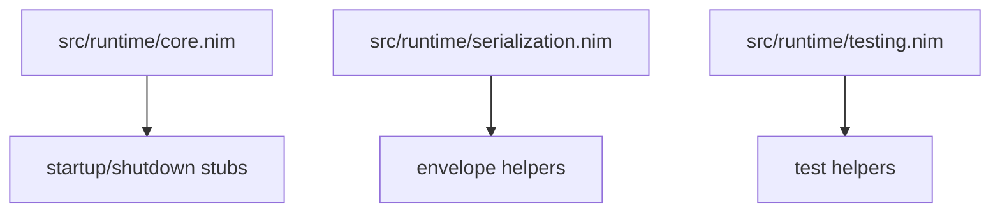

# Chapter 1 Module Flowcharts

```mermaid
flowchart TD
  A[src/runtime/core.nim] --> B[startup/shutdown stubs]
  C[src/runtime/serialization.nim] --> D[envelope helpers]
  E[src/runtime/testing.nim] --> F[test helpers]
```
