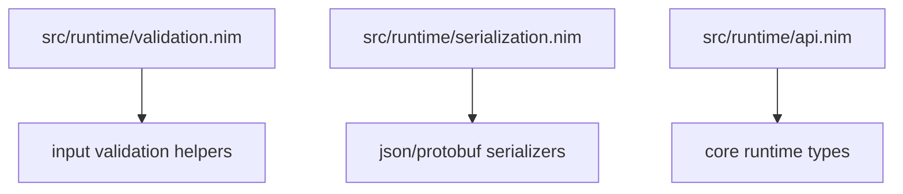

# Chapter 2 Module Flowcharts

```mermaid
flowchart TD
  A[src/runtime/validation.nim] --> B[input validation helpers]
  C[src/runtime/serialization.nim] --> D[json/protobuf serializers]
  E[src/runtime/api.nim] --> F[core runtime types]
```
