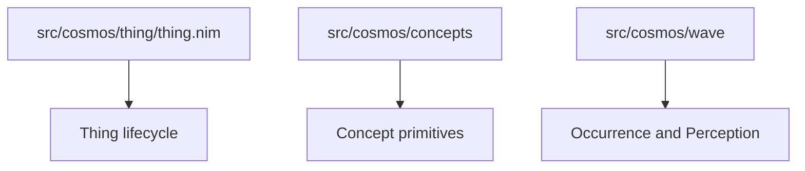

# Chapter 4 Module Flowcharts

```mermaid
flowchart TD
  A[src/cosmos/thing/thing.nim] --> B[Thing lifecycle]
  C[src/cosmos/concepts] --> D[Concept primitives]
  E[src/cosmos/wave] --> F[Occurrence and Perception]
```
