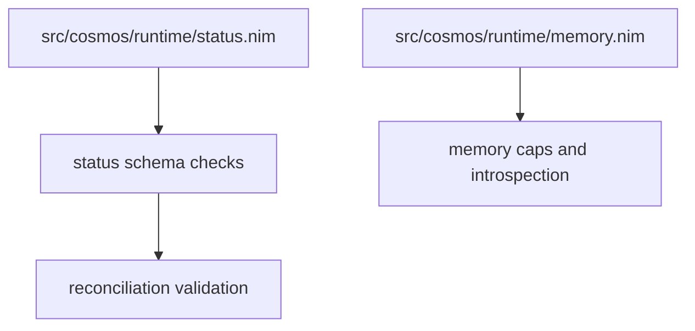

# Chapter 6 Module Flowcharts

```mermaid
flowchart TD
  A[src/cosmos/runtime/status.nim] --> B[status schema checks]
  C[src/cosmos/runtime/memory.nim] --> D[memory caps and introspection]
  B --> E[reconciliation validation]
```
