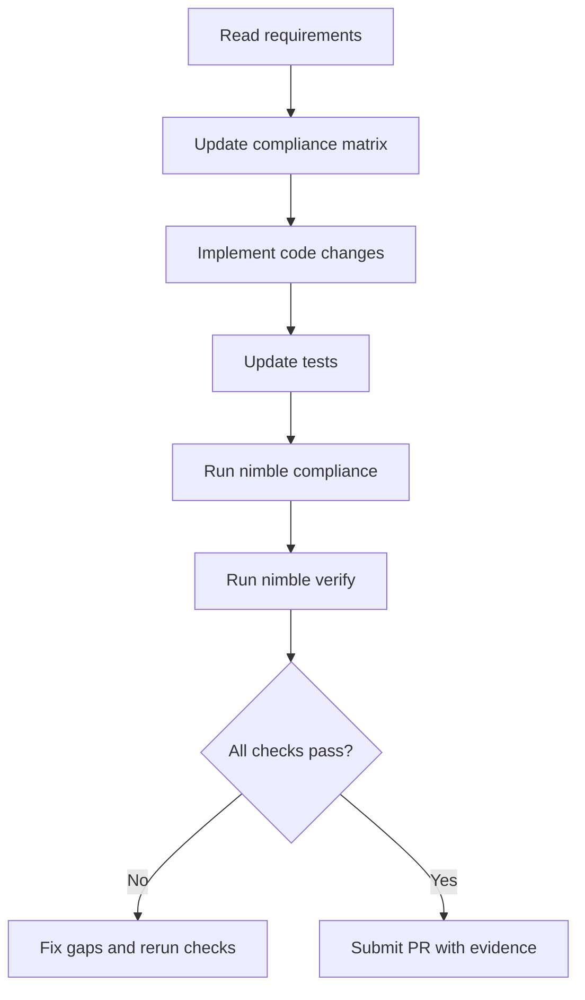
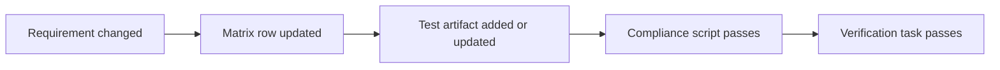

# Wilder Cosmos Runtime - Development Guidelines

This guide provides practical, repeatable steps for implementing requirements with clear evidence.

## Scope

Use this guide when:
- adding or changing requirements,
- implementing runtime behavior,
- preparing pull requests,
- reviewing compliance readiness.

## Standard Development Loop

1. Read the affected requirement sections in docs/implementation/REQUIREMENTS.md.
2. Update docs/implementation/COMPLIANCE-MATRIX.md with intended verification artifacts.
3. Implement code changes.
4. Add or update tests.
5. Run compliance and verification tasks.
6. Include evidence in the pull request.

Example commands:

```powershell
nimble compliance
nimble test
nimble verify
```

Expected outcome:
- compliance script reports pass,
- test compile checks pass,
- no missing compliance matrix mappings.

## Input Validation Practices

When implementing any public procedure:
1. **Validate at the boundary:** all public procs must validate inputs immediately.
2. **Use fail-fast validation:** reject invalid inputs without downstream processing.
3. **Centralize validation logic:** use helper procedures from `runtime/validation.nim`
   or create reusable helpers in your module.
4. **Document validation rules:** in the proc docstring, list all validation checks
   and expected errors.
5. **Sanitize error messages:** never expose sensitive data (credentials, keys,
   personal info) in error messages or logs.
6. **Log failures with context:** include invalid input (or hash), rule violated,
   and operation context.

Example proc with validation:

```nim
proc user__setAge(age: int): bool =
  ## Set user age. Validates age is in range [0, 150].
  ##
  ## Raises: ValueError if age is invalid.
  if age < 0 or age > 150:
    raise newException(ValueError,
      "Age must be in range [0, 150], got: " & $age)
  # ... proceed with mutation
  return true
```

## Requirement Change Checklist

When editing requirements:
- add or update terms if new terminology appears,
- add at least one concrete command or behavioral example,
- add or update one diagram for complex flow changes,
- add or update chapter module flowcharts for every touched module in
  `docs/implementation/ChapterX/MODULE-FLOWCHARTS.md`,
- update docs/implementation/COMPLIANCE-MATRIX.md in the same change set,
- confirm scripts/check_requirements.ps1 still passes,
- if a requirement involves data handling or validation, update SPECIFICATION.md
  section 24 (including §24.9–§24.14 for validating prefilter work).
- if validating prefilter semantics change, update docs/implementation/Chapter2/VALIDATION-FIREWALL-REQUIREMENTS.md,
  docs/implementation/PLAN.md (Chapter 2C), and docs/implementation/COMPLIANCE-MATRIX.md in the same change set.

## Code Comment Contract

For each `.nim` file:
- include identity header lines: `# Wilder Cosmos <version>`,
  `# Module name: <module name>`, and
  `# Module Path: <workspace-relative path>`,
- include `Summary`, `Simile`, `Memory note`, and module-level `Flow` in the header block,
- place a `Flow` comment directly above every `proc` declaration,
- use professional, plain language with direct verbs,
- avoid emotional or figurative wording in procedural comments,
- generate new module headers from templates in `templates/headers/` using
  `scripts/new_nim_module.ps1`.

## Naming Conventions

- **Format:** `typeObject__verb()` (double underscore between type and verb). Use lowercase and underscore separators for readability.
- **TypeObject:** a singular noun identifying the subject, module, or primary type the function acts on.
- **Verb:** an imperative present-tense action describing what the proc does (e.g., `run`, `dispatch`, `create`, `commit`).
- **Examples:** `playground__run()`, `thing__create()`, `ledger__commit()`.
- **Avoid** generic verbs like `handle` for exports; prefer concrete verbs that convey intent. If an API requires a parameter named `handle` (for example `registerModule(..., handle: proc ...)`), name your exported proc using the `typeObject__verb()` style and pass it as the `handle` argument.
- **When to use manager/controller:** reserve `*_manager` or `*_controller` for objects that encapsulate state and multiple coordinated operations.

## Entry Point Module Naming

- **Standard:** Append `_main` to any entry point module.
- **Purpose:** This ensures clarity and consistency in identifying entry points.
- **Examples:**
  - `runtime_main.nim` for the runtime entry point.
  - `console_main.nim` for the console entry point.
- **Scope:** Applies to all new and existing entry point modules.
- **Rationale:** This convention avoids ambiguity and aligns with the project's structured naming approach.

## Line Wrapping

- **Wrap width:** All source code lines and code examples must be wrapped at 80 characters.
- **Scope:** Applies to `.nim` source, code blocks in documentation, and inline examples in docs.
- **Tooling:** Prefer automated wrapping (formatters or editor settings). For signatures, break after logical separators and keep continuations indented.

## PR Evidence Checklist

For each requirement area touched in a PR:
- Requirement reference: section title in docs/implementation/REQUIREMENTS.md
- Implementation reference: file path and proc/type name
- Verification reference: test file or validation script
- Outcome: pass/fail with short evidence note

Example evidence row:

| Requirement | Implementation | Verification | Outcome |
| --- | --- | --- | --- |
| Console Subsystem Requirements | src/runtime/console.nim printRuntimeStatus | tests/console_status_test.nim | Pass (compile check) |

Use .github/pull_request_template.md for all pull requests and complete every required section.

## Development Flow Diagram



## CI Workflow Behavior

Pre-release verification workflow:
- `.github/workflows/pre_release_verify.yml` runs on push to `main` and `release/**`, on pull requests targeting `main`, and by manual dispatch.
- It must run `nimble compliance` and `nimble verify`.

Release artifact workflow:
- `.github/workflows/release_artifacts.yml` runs on `v*` tags and by manual dispatch.
- It must build the full cross-platform matrix, run installer contract checks, generate checksums, and publish manifest metadata.

## Requirement-to-Test Update Diagram



## ND-Friendly Writing Rules

Use these rules in comments, docs, help text, templates, and tests:
- use short sentences and direct verbs,
- define new terms before using them repeatedly,
- **expand every acronym or initialialism on its first use in every file.**
  Write the full term, then the short form in parentheses:
  `Full Name (ABBR)`. Subsequent uses may use the short form alone.
  This applies without exception to source files, docs, comments,
  help text, templates, tests, plans, and walkthroughs,
- avoid figurative or emotional language in procedural instructions,
- keep examples executable and complete,
- prefer one concept per paragraph or bullet.

---
*&copy; 2026 Wilder. All rights reserved.*\
*Contact: teamwilder@wildercode.org*\
*Licensed under the Wilder Foundation License 1.0.*\
*See LICENSE for details.*