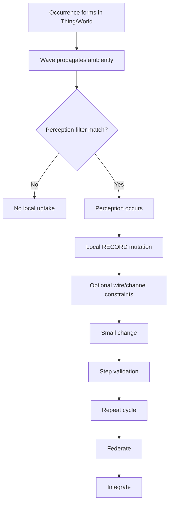
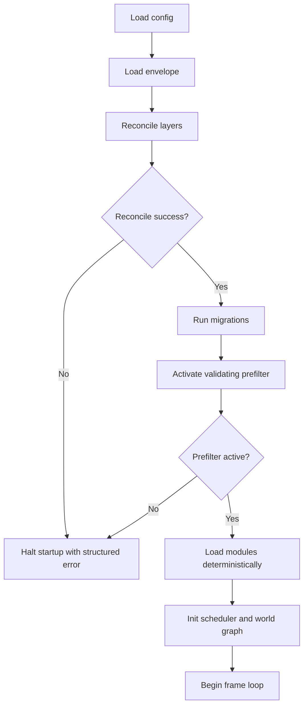

# Wilder Cosmos Runtime � Requirements

This document defines what must be true for the Wilder Cosmos Runtime to be correct.
Specifications (how each requirement is made true) live in `docs/implementation/SPECIFICATION-NIM.md`.

---

## Terms and Definitions

- **Cosmos instance**: a single running runtime process and its active Thing/World topology.
- **Console session**: one terminal attachment context bound to exactly one Cosmos instance.
- **Thing / World / Scope**: the same primitive seen from different aspects.
  - Thing: identity aspect.
  - World: interior aspect.
  - Scope: region visible from within a Thing boundary.
- **Occurrence**: immutable internal truth inside a Thing/World.
- **Wave**: externalized Occurrence in the medium; ambient, undirected, non-coercive.
- **Perception**: local awareness event produced when a Thing's filters match ambient Waves.
- **RECORD**: atomic temporal unit of internal change; internalized Occurrence.
- **Bridge**: a Thing/World validation firewall that touches another World and translates boundary effects.
- **Wire (pattern)**: optional designer-level containment over Wave propagation.
- **Channel (pattern)**: optional designer-level tag on Waves and filter on Perceptions.
- **Concept (pattern)**: immutable declarative template used inside Worlds.
- **Schema / RECORD type (pattern)**: structural declarations used inside Things/Worlds
- **Schema version**: integer version for persisted status and migration decisions.
- **Epoch**: deterministic frame-order counter used for sequencing and replay.
- **Reconciliation**: deterministic rebuild or repair process across persistence layers.
- **Primary layer**: authoritative persisted full-copy state.
- **Secondary layer (txlog)**: append-only transaction log.
- **Tertiary layer**: signed periodic snapshot store.
- **Specialist (pattern)**: Thing with narrow capability declared in interrogatives.
- **Delegation Occurrence**: Occurrence pattern requesting specialist handling of a subproblem.
- **Growth model**: Small -> Step -> Repeat -> Federate -> Integrate scaling pattern.
- **RuntimeState**: Represents the overall state of the runtime, including modules and their contexts.
- **ModuleState**: Represents the state of an individual module within the runtime.
- **ReconcileResult**: Outcome of a reconciliation process, indicating success or failure.
- **Envelope Metadata**: Metadata fields (`schemaVersion`, `epoch`, `checksum`, `origin`) used for persistence and reconciliation.
- **Validation mask**: fixed-width bitmask precomputed at build time from a `ValidationRecord`, encoding all structural expectations (required presence, type constraints, ordering, cardinality) for one signature key.
- **Payload mask**: fixed-width bitmask computed at runtime from an inbound payload using the same bit layout as the corresponding validation mask, encoding structural properties actually present.
- **Mask conjunction**: boolean AND comparison `(validationMask AND payloadMask) == validationMask` used as the canonical hot-path structural validation operation.

### Updated Storage and Persistence Requirements

- Every persisted record must include the following metadata fields:
  - `schemaVersion`: Integer version for persisted status and migration decisions.
  - `epoch`: Deterministic frame-order counter used for sequencing and replay.
  - `checksum`: SHA256 checksum for data integrity verification.
  - `origin`: String indicating the source of the record.
  - `txId`: String transaction identifier for replay and duplicate suppression.
  - `timestamp`: ISO 8601 commit timestamp for ordering diagnostics and recovery.
- The file-backed persistence layout must be deterministic and use:
  - `state/runtime.json` for runtime primary state.
  - `state/modules/<name>.json` for per-module primary state.
  - `state/txlog/<epoch>.txlog` for newline-delimited JSON transaction entries.
  - `state/snapshots/<epoch>_snapshot.json` for signed full-copy snapshots.
- The runtime must deterministically reconcile state from any two available layers, or from a single layer plus transaction log, on load or after corruption.
- Each layer must be independently checksummed and validated on access.
- Each committed transaction must append exactly one idempotent txlog entry containing at least `txId`, `epoch`, `checksum`, and `timestamp`.
- Snapshot restore must validate checksum and signature metadata before replacing the primary layer.
- File-backed writes must prevent partial files by writing to a temporary file and then performing an atomic replace.
- Irreconcilable divergence must halt startup with a structured error containing `haltedAt`, `divergedAt`, and `recoveryGuidance`.

---

## Core Architectural Principles (v0.1.1)

The following architectural principles apply to all installer, ecosystem, and runtime
behaviour. These statements clarify governance and operational expectations referenced
elsewhere in the requirements and specification. They do not introduce new features;
they record constraints already expected by project stakeholders.

Terminology update: runtime communication is Wave-based. Legacy references to
"precept" or "precepts" are superseded by "Wave" and should be treated as older
vocabulary.

- Thing = World = Scope: changing scope is changing worlds; changing worlds is changing things.
- Waves are the only communication physics: ambient, undirected, non-coercive truth in the medium.
- Perception governs understanding: Things only understand Waves through local filters.
- Waves over wires: wires are optional designer-level containment over Waves, not new primitives.
- Channels are tuning: optional tags on Waves and optional filters on Perceptions.
- Occurrence is the only mechanism of change: Waves externalize Occurrences; RECORDS internalize Occurrences.
- Bridges are validation firewalls: Bridges are Thing/World templates that translate boundary effects when instantiated.
- No new primitives: only Thing/World, Occurrence, Wave, Perception, and RECORD are primitive.
- Growth model: adopt a Small -> Step -> Repeat -> Federate -> Integrate approach.

### Core Principle Use Cases

1. Ambient Wave perception
  - Use case: an Occurrence in one Thing externalizes as a Wave.
  - Allowed: nearby Things perceive it only if local filters match.
  - Not allowed: coercive uptake, forced processing, or cross-boundary state mutation.

2. Voluntary reversible entry/exit
   - Use case: a module joins a federation for diagnostics, then detaches after analysis.
   - Allowed: join and detach are explicit commands recorded in logs.
   - Not allowed: permanent implicit enrollment with no detach path.

3. Waves over wires and channels
  - Use case: designers apply a wire and channel tags for a scoped communication domain.
  - Allowed: optional containment and tuning compiled to Perception masks and validation rules.
  - Not allowed: introducing target-ownership semantics or directional physics.

4. Growth model (Small -> Step -> Repeat -> Federate -> Integrate)
   - Use case: ship one module with deterministic tests, add one capability, repeat,
     then federate with another instance only after replay stability checks pass.
   - Allowed: incremental releases with measurable acceptance criteria.
   - Not allowed: large multi-subsystem cutovers without intermediate validation.

### Core Principle Flow Diagram




---

## Console Subsystem Requirements

### Identity

- The subsystem is called the **Console**. It is not a REPL.
- The Console is the truth-surface and control panel for a single running Cosmos instance.
- The Console is a runtime navigator, debugger, and introspection surface � not a language
  interpreter.

### Console Entrypoint

- The repository must provide a thin CLI entrypoint at `src/console_main.nim`.
- The console entrypoint must orchestrate attachment and watch startup only; it must not own runtime lifecycle, persistence, or reconciliation logic.
- The console entrypoint must support the following flags:
  - `--config <path>` - required runtime config path.
  - `--mode <dev|debug|prod>` - optional runtime mode override.
  - `--attach <identity>` - optional auto-attach target.
  - `--watch <path>` - optional watch target started after attach.
  - `--log-level <trace|debug|info|warn|error>` - optional log level override.
  - `--port <N>` - optional port override (1-65535).
  - `--help`/`-h` - optional; prints full help text and exits 0.
- Launch without `--config` must exit non-zero and print usage.
- `--help`/`-h` is sovereign: exits 0 and bypasses all validation, including missing required flags.
- `--port` must be validated as an integer in range 1-65535; invalid values exit non-zero.
- `--log-level` must be validated against `trace|debug|info|warn|error`; invalid values exit non-zero.
- Help text must include a minimal example and a full example.
- CLI overrides must not inject defaults: only explicitly provided flags apply to `RuntimeConfigOverrides`.
- Attach binds identity and permissions to the current session only; detach must clear that session state and return the layout to a neutral state.

### Instance Binding

- Each Console session or tab is bound to exactly one Cosmos instance at a time.
- The Console process may attach and detach freely, but no session may observe more than
  one instance simultaneously.
- No cross-instance queries are permitted.
- The Console must never leak or infer information about other instances.

### Three-Layer Layout

The Console must render output in this fixed vertical order:

1. **Status Bar** � world-level truth
   - Required fields: frame, thing count, tempo state, scheduler state, runtime active/inactive
   - Additional global metrics may be added as the system evolves
   - Updates continuously while attached; shows a neutral "no instance attached" state when detached

2. **Scope Line** � ontological truth
   - Format: `(COSMOS:CHILD1)`
   - Represents the Thing namespace the user is currently inside
   - Initializes to the instance root Thing on attach; resets to a neutral state on detach

3. **Prompt Line** � structural truth
   - Format: `/path/dir/inside/the/thing>`
   - Represents the filesystem-like path within the current Thing
   - Initializes to `/` on attach; resets to a neutral state on detach

The vertical order of these three layers is an invariant and must not change.

### `ls` Output Rules

- One flat list. No sections, no headers, no indentation.
- Each entry on its own line.
- Things: `[ThingScope]/`
- Directories: `Name/`
- Virtual directories: `*Name/`
- Files: `Name`
- No extra decoration.

Example:

```
[AThingScope1]/
Subdir1/
*virtDir/
ADirectory/
File.sh
```

### Command Set

The Console must support the following commands:

**Navigation**
- `ls` � list children of the current node
- `cd` � move through the world graph
- `pwd` � show current path and scope

**Introspection**
- `info` � show metadata for the current node
- `peek <thing>` � shallow inspect a Thing
- `watch <bus|wave>` � tail a live stream
- `state` � show runtime state summary
- `specialists` � list all active specialists and their declared capabilities
- `delegations` � list active or recent delegation Occurrences
- `world` � show structural references in the world graph
- `claims` � show relational assertions in the world ledger

**Execution and Mutation**
- `run <action>` � execute an action on a Thing
- `set <field> <value>` � mutate a field
- `call <method> [args]` � invoke a method

**Instance Management**
- `attach <instance>` � connect to a running Cosmos instance
- `detach` � disconnect from the current instance
- `instances` � list discoverable runtimes

**Console Ergonomics**
- `help` � show command help
- `clear` � clear the screen
- `exit` � close the Console

### Command Examples (Expected Output)

Example 1: attach to an instance

Input:

```
attach alpha-local
```

Expected output:

```
Attached to instance: alpha-local
Permission: read-write
Capabilities: watch,state,world,claims
Scope: (COSMOS:ROOT)
Path: /
```

Example 2: list current node contents

Input:

```
ls
```

Expected output (flat, one entry per line):

```
[ROOT]/
modules/
*streams/
README.txt
```

Example 3: detached command guardrail

Input:

```
state
```

Expected output when detached:

```
ERROR: command requires an attached instance. Use: attach <instance>
```

Example 4: detach cleanly

Input:

```
detach
```

Expected output:

```
Detached from instance: alpha-local
Active watches cancelled: 1
Scope reset: (none)
Path reset: /
```

### Attach Protocol

- `attach <instance>` binds the Console session to a specific running Cosmos instance.
- Attachment requires: instance identity verification, permission check (read-only or
  read-write), and capability negotiation.
- On successful attach:
  - The status bar begins streaming world-level truth.
  - The scope line initializes to the instance root Thing.
  - The prompt initializes to `/`.
  - All commands operate strictly within this instance's ontology and runtime.

### Detach Protocol

- `detach` cleanly severs the Console from the instance.
- Detach must: flush pending output, cancel active watches, clear instance-bound caches,
  and reset scope and prompt to a neutral state.
- After detach:
  - The Console remains alive.
  - No commands may introspect or mutate until a new attach.
  - The status bar shows a neutral "no instance attached" state.

### Reattach and Switching

- A Console session may attach to a different instance after detaching.
- Each attach is a fresh binding. No state is carried across instances.
- Multiple tabs or windows may each attach to different instances simultaneously.

### `watch` Behavior

- When `watch` is active, it takes over the full terminal screen.
- The three-layer layout is suspended for the duration of the stream.
- `Ctrl+C` or a configurable timeout returns the Console to the three-layer layout.
- The status bar re-renders immediately on resume.
- While active, `watch` must emit snapshot lines when the observed data changes.
- Detach must stop active watches cleanly before clearing session state.

### Commands Available Without Attachment

- `attach`, `instances`, `help`, `clear`, and `exit` must work without an active attachment.
- All other commands require an attached instance and must produce a clear error if invoked
  while detached.

---

## Runtime Start Coordinator Requirements

### Identity and Boundaries

- The canonical runtime start coordinator entrypoint must always resolve to `cosmos.exe`.
- Compatibility aliases such as `cosmos` may exist on non-Windows platforms, but they must
  delegate to `cosmos.exe` and must not bypass startup orchestration.
- The coordinator is the primary startup entrypoint for launching a Cosmos instance.
- The coordinator owns startup orchestration and runtime lifecycle handoff.
- The existing console entrypoint at `src/console_main.nim` remains a thin attachment and
  watch surface. It must not become the startup owner.

### Coordinator Launch Flags and Switches

- The coordinator must support:
  - `--config <path>` (required) - runtime config path.
  - `--mode <dev|debug|prod>` (optional) - startup mode override.
  - `--console <auto|attach|detach>` (optional) - console launch mode.
  - `--watch <path>` (optional) - watch target to open on initial console attach.
  - `--daemonize` (optional) - run detached/background startup behavior.
  - `--log-level <trace|debug|info|warn|error>` (optional) - log level override.
  - `--port <N>` (optional) - port override (1–65535).
  - `--help`/`-h` (optional) - print full help text and exit 0.
- Launch without `--config` must exit non-zero and print usage.
- `--help`/`-h` is sovereign: exits 0 and bypasses all validation, including missing required flags.
- `--watch <path>` without an explicit `--console` flag resolves console mode contextually:
  - if `--daemonize` is set: effective console mode is `detach`.
  - if `--daemonize` is not set: effective console mode is `attach`.
- `--daemonize` combined with explicit `--console attach` is an invalid combination; fail fast.
- `--port` must be validated as an integer in range 1–65535; invalid values exit immediately.
- `--log-level` must be validated against `trace|debug|info|warn|error`; invalid values exit immediately.
- CLI overrides must not inject defaults into `RuntimeConfigOverrides`.
- Invalid flag combinations must fail fast with non-zero exit and usage output.

### Startup and Console Integration

- `--console detach` starts the runtime without launching a console process.
- `--console auto` starts the runtime and launches an attached console session.
- `--console attach` starts the runtime and waits for an external console attach flow
  before reporting startup completion.
- Console attach and detach must remain independent of coordinator lifetime after startup.

### Exit and Error Contract

- Exit code `0` means startup completed and runtime is active.
- Any startup failure must exit non-zero.
- Startup failure output must include structured fields `haltedAt`, `reason`, and
  `recoveryGuidance`.
- Startup diagnostics must follow existing host observability and safe-logging
  constraints.

### Runtime Entrypoint CLI Interface Requirements

- The coordinator CLI interface must parse and validate launch arguments deterministically.
- The coordinator CLI interface must expose a clear usage contract for:
  - `--config <path>`
  - `--mode <dev|debug|prod>`
  - `--console <auto|attach|detach>`
  - `--watch <path>`
  - `--daemonize`
  - `--log-level <trace|debug|info|warn|error>`
  - `--port <N>`
  - `--help`/`-h`
- Mode aliases must normalize as:
  - `dev` -> `development`
  - `debug` -> `debug`
  - `prod` -> `production`
- Unknown arguments, missing values, and invalid flag combinations must fail fast
  with non-zero exit and usage output.
- `--watch` must only be valid in attached console startup modes (explicit `attach`
  or contextually resolved `attach` behavior).
- `--daemonize` combined with explicit `--console attach` is an invalid combination.
- The coordinator must return a structured `CoordinatorStartupReport` on successful startup.
- Help text must include a minimal example and a full example.
- The coordinator CLI interface must remain a thin orchestration surface and must not
  bypass lifecycle gate enforcement.

---

## Ontology Requirements

- The runtime must implement exactly five primitives: **Thing/World**, **Occurrence**,
  **Wave**, **Perception**, and **RECORD**.
- Thing and World are one primitive seen through two aspects:
  - identity aspect -> Thing
  - interior aspect -> World
  - visible region from inside boundary -> Scope
- Changing scope is changing worlds; changing worlds is changing things.
- A Thing/World has a minimal existence contract:
  - **WHO**: identity.
  - **WHY**: purpose.
  - These are the only required fields for a Thing/World to exist.
- All other interrogatives are optional and world-defined grouping lenses over the
  Concept manifest, not separate entities:
  - **WHAT**: capabilities and structure.
  - **WHERE**: location and containment.
  - **WHEN**: tempo.
  - **HOW**: mechanics.
- Relational declaration is optional but recommended for richer semantics:
  - **NEEDS**
  - **WANTS**
  - **PROVIDES**
- Occurrences are immutable internal truths inside a Thing/World.
- Waves are externalized Occurrences in the medium and are the only communication physics.
- Perceptions are local awareness events produced when local filters match ambient Waves.
- RECORD is the atomic temporal unit of internal change and is the internalized Occurrence.
- Concepts, Schemas, and RECORD types are patterns inside Worlds, not primitives.
- Wires, Channels, Bridges, Systems, and Constellations are patterns, not primitives.
- No hidden behavior. No implicit coercion. No directional delivery semantics.

---

## Runtime Lifecycle Requirements

- The runtime must follow a deterministic startup sequence:
  1. Load configuration and persistence backend.
  2. Load runtime envelope and metadata.
  3. Reconcile persisted layers.
  4. Run migrations for all modules whose schemaVersion has changed.
  5. Activate the validating prefilter: load generated validation artifacts,
     verify invariants and mask widths, build the immutable runtime index, and
     block ingress until activation succeeds.
  6. Load modules in deterministic order.
  7. Initialize scheduler, tempo, and world graph.
  8. Begin frame loop.

- The runtime lifecycle state machine must progress through these ordered states without skipping:
  `NotStarted -> ConfigLoaded -> PersistenceReady -> EnvelopeLoaded -> Reconciled -> Migrated -> PrefilterActive -> ModulesLoaded -> FramesRunning -> Running -> ShuttingDown -> Stopped`.

- The runtime must follow a deterministic shutdown sequence:
  1. Flush pending transactions.
  2. Write final snapshots.
  3. Stop scheduler and tempo.
  4. Unload modules.
  5. Close persistence backend.

- The runtime must enforce:
  - No partial startup.
  - No silent failure.
  - No module execution before reconciliation completes.
  - No ingress before validating prefilter activation completes.
  - Deterministic module load order.
  - `loadModulesInOrder` must not run unless reconciliation has passed.
  - Ingress must remain closed unless the validating prefilter is active.
  - A failed lifecycle step freezes the lifecycle at that step and halts immediately.

- Errors during startup, reconciliation, or migration must:
  - Halt startup.
  - Produce structured error output.
  - Provide a recovery path.
  - Populate `haltedAt` with the failing lifecycle step.
  - Populate `recoveryGuidance` with an actionable operator-facing next step.
  - Avoid interpolating runtime file paths, secrets, or payload contents into guidance text.

## Host Observability Requirements

- The runtime must emit structured host events for startup, reconciliation, migration, prefilter activation, and shutdown.
- Host logging must use stable event kinds instead of free-form lifecycle strings.
- At minimum, the host event model must include:
  - `evStartupStep`
  - `evReconcilePass`
  - `evReconcileHalt`
  - `evMigrate`
  - `evPrefilterActivated`
  - `evShutdown`
- At least one startup-step event must be emitted for each lifecycle step executed during startup.
- Reconciliation must emit either a pass or halt event and include layer-count context without exposing raw payloads.
- Log messages must never contain raw payloads, keys, secrets, or other sensitive material; use digests, sizes, and step names instead.
- Production mode must not log below info severity.

### Runtime Lifecycle Flow Diagram



---

## Interrogative Manifest Requirements

- Thing = World = Scope is invariant: interrogatives describe one Thing/World
  interiority and do not define separate entities.

- Minimal existence contract for every Thing/World:
  - **WHO** identity.
  - **WHY** purpose.
  - These are the only required interrogative fields.

- Optional world-defined interrogative lenses over the Concept manifest:
  - **WHAT** capabilities and structure.
  - **WHERE** location and containment.
  - **WHEN** tempo.
  - **HOW** mechanics.

- Optional relational contract (recommended for richer semantics):
  - **NEEDS** dependencies and prerequisites.
  - **WANTS** optional desires or preferences.
  - **PROVIDES** outputs, emissions, or services.

- Interrogatives must be:
  - Declarative.
  - Human-readable.
  - Persisted.
  - Introspectable via the Console.
  - Validated when present.

- Missing **WHO** or **WHY** must produce a structured error.
- Missing optional interrogatives must not produce an error.
- Specialist manifests should declare non-empty `PROVIDES` and `NEEDS`.
- Cosmos-native modules must define their contract in code, with manifest views derived from code.
- External-process wrappers may use handwritten manifests as the authoritative contract source.

---

## Status Requirements

- Every Concept must declare a **Status** section describing the mutable interior
  condition of its Things.
- Status must be:
  - Declarative.

---

## Testing Infrastructure Requirements

- **Test harness:** The repository must provide a reusable test harness at `tests/harness.nim` exposing setup/teardown helpers and common utilities (temporary directory management, JSON helpers).
- **Test module template:** A canonical test module template must be available in `templates/test_module.nim` to ensure consistent test structure and usage across modules.

These artifacts enable consistent, reproducible unit and integration tests required by multiple PLAN chapters.
  - Schema-validated.
  - Persisted.
  - Versioned.
  - Migratable.
  - Introspectable via the Console.

- Status must not contain behavior; only declarative shape and invariants.

- Status invariants must be checked:
  - At load time.
  - After each mutation.
  - During reconciliation.

---

## Memory Requirements

- The runtime must enforce a declarative memory model:
  - **State memory** � persisted Status.
  - **Perception memory** � recent perceptions.
  - **Temporal memory** � frame and epoch counters.
  - **Module memory** � per-module soft cap (1 MB unless overridden).

- Memory usage must be:
  - Deterministic.
  - Bounded.
  - Introspectable.
  - Logged when thresholds are exceeded.

- Memory violations must produce structured errors.

---

## Delegation & Specialization Requirements

- Delegation is voluntary, reversible, and pull-based. No Thing may be compelled to
  delegate, and no specialist may be compelled to accept.
- A Thing may delegate a subproblem to a specialist if doing so increases clarity,
  safety, or correctness. Delegation is a design choice, not a runtime obligation.
- A specialist is a Thing whose Concept declares a narrow, deep capability. There is
  no separate "specialist" primitive � specialization is a property of the Concept.
- Specialists must declare their capabilities in their Interrogative Manifest
  (specifically: `PROVIDES`, `NEEDS`, and optional `HOW`).
- Delegation must not create coercive or hidden relationships. All delegation
  relationships must be visible, introspectable, and reversible.
- Delegation must be represented through Occurrences. No direct calls, no shared
  memory, no back-channels. The Occurrence is the only mechanism of delegation.
- Delegation must be deterministic and introspectable via the Console.
- Delegation must be logged and testable. Every delegation request and result must
  appear in the transaction log.
- Delegation must not bypass the runtime lifecycle or scheduler. Delegation
  Occurrences participate in the frame loop like any other Occurrence.
- Delegation must not violate sovereignty: the delegating Thing and the specialist
  Thing remain independent. Neither may mutate the other's state.

---

## World Ledger Requirements

- The runtime must maintain a **World Ledger** as a pattern inside each Thing/World:
  a declarative, append-only record of structural references and relational claims.
- References are explicit, typed topology declarations inside Scope.
  No implicit or inferred references are permitted.
- Claims are relational assertions inside Scope. Claims are declarative,
  signed by the asserting Thing/World, and non-coercive.
- The World Ledger must be:
  - Deterministic.
  - Persisted (within the three-layer persistence model).
  - Introspectable via the Console (`world`, `claims` commands).
  - Validated at load time.
- No hidden edges. No inferred relationships. All structure must be declared.
- The World Ledger must not bypass the Occurrence/Wave/RECORD model.
  Topology mutations must flow through Occurrences and become local RECORD updates.

---

## World Graph Requirements

- The runtime must maintain a **World Graph** as the topology view of Thing/World Scope.
- Nodes are Thing/World instances. Edges are explicit references from the World Ledger pattern.
- Every Cosmos instance has a single root Thing/World.
- The world graph must be:
  - Deterministic.
  - Reconstructible from persisted state.
  - Introspectable via the Console (`world`, `ls`, `cd`, `pwd` commands).
- No implicit edges. No inferred relationships. All edges must originate from the
  World Ledger.
- The world graph is the authoritative structure for:
  - Console navigation (scope and path).
  - Perception visibility and local topology constraints.
  - The frame loop.

---

## Runtime Configuration Requirements

- The runtime must load its configuration from a **Cue-validated source** (a Cue schema
  produces a JSON/YAML export that the runtime reads at startup).
- The configuration schema must declare the following fields explicitly:
  - `mode`: `"debug"` | `"production"` � controls logging verbosity and debug checks.
  - `transport`: `"json"` | `"protobuf"` � selects the active messaging serializer.
  - `logLevel`: `"trace"` | `"debug"` | `"info"` | `"warn"` | `"error"` � minimum log
    severity threshold.
  - `endpoint`: string � hostname or address for the messaging system.
  - `port`: integer � port for the messaging system.
- The schema must enforce validation rules:
  - `mode = "production"` must not allow `logLevel = "trace"` or `logLevel = "debug"`.
  - `port` must be in the range `[1, 65535]`.
  - `endpoint` must be a non-empty string.
- Sane defaults must be provided for all fields; the schema must remain explicit and strict
  even when defaults are applied.
- The configuration workflow must be: edit `config/runtime.cue`, export config JSON, validate the export against the Cue schema, then load the validated JSON into `RuntimeConfig`.
- The repository must provide a validation script for exported config that exits non-zero on schema violation.
- Configuration overrides must be supported with this precedence order, from lowest to highest:
  1. Config file
  2. Environment variables
  3. CLI flags
- Supported environment variable overrides must include `COSMOS_MODE`, `COSMOS_LOG_LEVEL`, and `COSMOS_PORT`.
- All overrides must pass the same validation rules as file-sourced values.
- File-based config loads must require all fields to be present after applying defaults; overrides may replace values but must not bypass validation.
- Invalid configurations must be rejected at config-load time with a structured error.
- Configuration must be mapped into Nim types at startup and made available to all
  subsystems via a single loaded-config record; no subsystem may read raw config files
  directly after startup.

---

## Wave Serialization Requirements

- Runtime communication physics is Wave propagation only.
- Serialization formats are implementation patterns for encoding Wave payloads,
  not communication primitives.
- Protobuf and JSON are permitted as Wave payload schema/encoding patterns.
- Any envelope schema must represent ambient Waves and must not imply
  target ownership or directional transport semantics.
- Envelopes must support forward compatibility:
  - Fields must not be renumbered.
  - Removed fields must be reserved.
  - Evolution is additive only.
- In debug mode, encoded Wave envelopes must be introspectable.
- In production mode, introspection overhead must not be incurred.

---

## Serialization Transport Requirements

- The runtime must support **dynamic switching** between JSON and Protobuf serializers
  at runtime, determined by the loaded configuration (`transport` field).
- The active serializer must be selected once at startup and injected into all subsystems
  that require Wave payload encoding/decoding.
- **JSON** is the serializer for:
  - `mode = "debug"` and `transport = "json"`.
  - Filesystem bridge (persistence layer reads/writes).
  - Fallback when Protobuf is unavailable.
- **Protobuf** is the serializer for:
  - `mode = "production"` and `transport = "protobuf"`.
- The serializer abstraction must present a uniform encode/decode interface regardless
  of the underlying format.
- JSON serialization must be stable and round-trippable for all Wave envelope and
  payload patterns.
- Protobuf serialization must be schema-versioned and forward-compatible.

---

## Tempo Types Requirements

- The runtime must support the following tempo types:
  - **Event** � triggered by an Occurrence.
  - **Periodic** � triggered at a fixed interval.
  - **Continuous** � triggered every frame.
  - **Manual** � triggered by explicit command.
  - **Sequence** � triggered in a declared order of steps.
- Each Thing's Concept must declare its tempo type in its Tempo section.
- Tempo types must be:
  - Declarative.
  - Validated at load time.
  - Introspectable via the Console.
- Tempo type must not affect sovereignty � a Thing's tempo determines when it
  participates, not whether it can be coerced.

---

## Scheduler Requirements

- The runtime must implement a deterministic scheduler for the frame loop.
- The scheduler must enforce:
  - **Deterministic ordering**: given the same state and pending Occurrences, the
    same frame produces the same result.
  - **Bounded execution**: no single Thing or module may consume unbounded time
    within a frame.
  - **Cooperative yielding**: Things must yield control back to the scheduler after
    processing. No preemption.
- Occurrences must be processed in epoch order within each frame.
- Perception delivery order within a frame must be deterministic.
- Module callbacks within a frame must execute in deterministic order.
- Scheduler errors (e.g., epoch overflow) must halt the runtime with a structured
  error.
- A Thing that fails repeatedly (configurable threshold) must be suspended from the
  frame loop with a structured error.

---

## Module System Requirements

- The runtime must distinguish between a minimal kernel and loadable modules.
- Modules must follow the canonical template and be independently documented.
- Each module must declare its memory cap and resource budget in its metadata.
- Module registration is static at startup; dynamic registration must be explicitly
  documented where supported.

---

## Phase X Requirements — DRY Wants/Provides, Capability Discovery, Multi-Module Provides (Nim-first)

### DRY Wants/Provides (No Double Entry)

- A Thing's `PROVIDES` contract must be declared exactly once in a canonical boundary declaration.
- Consumer Things must not re-declare provider signatures in `WANTS` declarations.
- `WANTS` declarations must reference capabilities using one of:
  - `ThingName.provideName`
  - whole-Thing reference: `ThingName`
- `WANTS` declarations must not require signature duplication in consumer declarations.
- Capability resolution must use provider Thing name, provide name, and provider-declared signature as the canonical triple.
- Resolution must fail fast and produce structured diagnostics when:
  - provider Thing does not exist,
  - provide does not exist,
  - signatures are incompatible,
  - multiple providers conflict for one capability key.

### Capability Discovery (Wave Availability)

- Startup must construct a deterministic global capability graph before module execution.
- The capability graph must include:
  - all discovered Things,
  - all declared provides,
  - all declared wants,
  - all capability signatures,
  - all module bindings mapped to provides.
- The capability graph must be exposed to:
  - lifecycle surfaces,
  - coordinator CLI (`cosmos capabilities`),
  - Concept registry inspection and resolution surfaces.
- Capability discovery must detect and report:
  - missing capabilities,
  - ambiguous capability providers,
  - incompatible signatures,
  - orphaned provides with no resolved consumer.
- Startup must halt before entering running state when fatal capability resolution fails.

### Multi-Module Provides (Nim and External Runtimes)

- A Thing may declare provides in one module and implement them in another module.
- Implementation modules may target Nim modules, Python modules, Rust crates, Node packages, or system binaries.
- The provide boundary must live in one canonical SEM/Nim boundary declaration source.
- Implementation modules must register provide implementations through one stable runtime contract:
  - ABI registration proc,
  - stable descriptor record,
  - or equivalent runtime descriptor payload.
- Startup must bind implementation modules to declared provides before capability resolution is finalized.
- Startup must emit structured errors and halt when:
  - a declared provide has no implementation binding,
  - an implementation is registered for an undeclared provide,
  - multiple implementations claim the same declared provide.

### Nim-first Boundary Rules (SEM Not Required)

- All boundary declarations must be representable in Nim while SEM remains optional.
- Provide declarations must be stored in either:
  - a Nim boundary file,
  - or a manually authored Concept declaration file.
- Wants references in Nim-first mode must use:
  - `ThingName.provideName`,
  - or whole-Thing reference `ThingName`.
- The Concept Derivation Engine must:
  - extract provides from Nim boundary declarations,
  - extract wants from Nim boundary declarations,
  - validate provider signatures and wants compatibility,
  - populate and refresh the Concept registry with resolved capability metadata.

### Phase X CLI Requirements

- `cosmos capabilities` must list:
  - all Things,
  - all provides,
  - all wants,
  - capability resolution status and issue counts.
- `cosmos concept resolve` must show:
  - mapping of wants to provider capabilities,
  - missing mappings,
  - ambiguous mappings,
  - signature mismatch diagnostics.
- Both commands must be deterministic for equivalent inputs and emit stable, parseable line-oriented output.

---

## Taxonomy Requirements

The project source structure must include:

```
cosmos/core/
cosmos/runtime/
cosmos/concepts/
cosmos/thing/
cosmos/wave/
cosmos/tempo/
cosmos/inventory/
cosmos/patterns/
cosmos/utils/
runtime_modules/
modules/
examples/
```

---

## Portability Requirements

- The runtime must run unmodified on Linux, BSD, macOS, Windows, and Haiku OS.
- Platform-specific code must be isolated in a portability layer.
- The runtime must support platforms and toolchains that are 7�10 years old.

---

## Performance Requirements

- Startup time must be less than 2 seconds on Tier 1 platforms.
- Memory usage must be bounded and deterministic.
- Perception filtering must be efficient enough for interactive frame rates.

---

## Security Requirements

- The runtime must enforce read/write protection at the instance boundary.
- Mode validation must be explicit; no silent mode promotion.
- No hidden channels between instances or modules.

---

## Data Handling and Validation Best Practices

### Input Validation

- All **public procedures** must validate input at the boundary. Private procedures
  may assume correctness of inputs transferred from validated public procs.
- Input validation must be **fail-fast**: detect and reject invalid inputs as early
  as possible to minimize downstream processing of bad data.
- Validation rules must be **explicit and declarative** in the type signature and
  docstring of each public proc.
- Validation must check:
  - **Type correctness**: ensure inputs match declared types (leveraging Nim's static
    type system).
  - **Structure validity**: ensure records and collections conform to expected shape.
  - **Value bounds**: ensure numeric inputs fall within acceptable ranges; ensure
    strings are non-empty or match required patterns; ensure collections do not
    exceed size limits.
  - **Preconditions**: ensure the runtime state is correct for the operation (e.g.,
    instance attached, module loaded).

### Efficient Validation

- Use **short-circuit evaluation**: if one check fails, immediately reject the input
  without running remaining checks.
- Prefer **compile-time validation** (via Nim's static type system and generic constraints)
  over runtime validation where possible.
- Cache validation results where applicable to avoid repeated checks on the same data.
- Avoid redundant checks by centralizing validation logic in reusable helper procedures.
- Document validation performance expectations for hot-path operations; avoid expensive
  validation (e.g., recursive traversal) in frame-loop-critical paths unless justified.

### Safe Data Handling

- Prefer **immutable data structures** for data that should not change (marked `const`
  or `let` in Nim).
- Use **value types** (records, tuples) instead of reference types (objects, refs) where
  appropriate to prevent unintended aliasing.
- **Avoid mutable shared state** between modules and instances. If state must be shared,
  make mutation explicit and guarded by a lock or transaction boundary.
- **Normalize data** to a canonical form before storage or transmission:
  - Strip whitespace; convert case consistently; resolve symbolic references to
    canonical identifiers.
- **Validate invariants** after every mutation to ensure consistency.
- Use **scope management** (RAII-style in Nim: defer/finalizers) to ensure resources
  are released even in the presence of errors.

### Integrity and Checksums

- Every **persisted record** must include a SHA256 checksum for integrity verification.
- Checksums must be validated:
  - **At load time**: on startup, during reconciliation, and when reading from disk.
  - **After every mutation**: if a mutation is applied, recalculate the checksum and
    update the persisted record.
  - **During serialization round-trips**: after deserializing a record (JSON or Protobuf),
    validate the checksum before using the deserialized data.
- Checksum validation failure must halt the operation and produce a structured error
  indicating the validation failure (do not silently corrupt or skip the data).

### Type Safety

- Leverage **Nim's static type system** to enforce type correctness at compile time.
  Use distinct types to distinguish between semantically different data (e.g.,
  `EpochCounter` vs. `SchemaVersion`).
- Avoid `Any`, `object`, or `ref object` without strong justification; use concrete,
  typed records instead.
- Use **dependent types** (via generics and constraints) where possible to encode
  invariants in the type (e.g., a `NonEmptyString` or `ValidEpoch` type).

### Error Handling and Recovery

- Validation failures must raise an exception with a **descriptive, actionable error message**.
  Include the invalid value (or a summary) and the validation rule that was violated.
- Do not expose sensitive data in error messages (e.g., private keys, credentials);
  sanitize error logs.
- Provide **recovery paths** for correctable errors (e.g., schema migration on version mismatch).
- Halt unrecoverable operations with a structured error and a suggestion for manual recovery.

### Logging and Auditing

- Log all **validation failures** with sufficient context for debugging:
  - Input value (or a hash/summary if sensitive).
  - Validation rule that was violated.
  - Stack trace (in debug mode).
  - Timestamp and operation context (e.g., which proc failed).
- Do not log sensitive data (credentials, private keys, personal information) even
  in debug mode; log hashes or metadata instead.
- In **production mode** (`mode = "production"`), suppress verbose debug logs; retain
  only error and warning logs.

### Alignment with Security and Transparency

- Input validation and safe data handling must support the **Confidentiality and Opacity**
  principle: ensure that invalid or corrupted data cannot leak information across
  instance boundaries or to unauthorized observers.
- Validation must be **deterministic**: given the same input, validation must always
  produce the same result.

### Validating Prefilter (Runtime Boundary)

- The runtime must enforce a **validating prefilter** as a first-class responsibility
  at the runtime boundary. This prefilter is part of runtime dispatch and recording,
  not an optional library feature.
- Invariant: no proc or function may receive unvalidated data.
- All inbound data must be structurally validated before:
  - being recorded as an Occurrence, or
  - being dispatched to any proc/function.
- Validation within the prefilter is schema/shape-based only:
  - no heuristics,
  - no inference,
  - no behavior scoring.
- Validation rules must be keyed by proc/function signatures (or stable equivalent
  identifiers) and resolved through an index with O(1) lookup on the hot path.
- The runtime must not dynamically parse schemas on the hot path.
- The runtime must not auto-fix invalid data and must not silently mutate payloads.
- Validation failures must be represented as explicit Occurrences with clear,
  non-ambiguous semantics, while preventing unvalidated payloads from entering
  user code.
- The runtime must be able to assert: if data reached user code, it was
  structurally valid.

#### Mask-Based Structural Validation

The prefilter must use a **mask-based comparison model** as the canonical mechanism
for structural validation on the hot path.

- **Validation mask**: a precomputed bitmask derived at build time from the
  `ValidationRecord` for each signature key. The validation mask encodes every
  structural expectation (required fields, allowed fields, type constraints,
  ordering, cardinality bounds) into a fixed-width bit layout.
- **Payload mask**: a bitmask computed at runtime from the inbound payload. The
  payload mask uses the same fixed-width bit layout as the validation mask and
  encodes the structural properties actually present in the payload.
- **Boolean conjunction check**: structural validation is performed by computing
  `(validationMask AND payloadMask) == validationMask`. If the result holds for
  all required-field and type-constraint regions of the mask, the payload is
  structurally valid for that signature.
- Mask generation must be deterministic and schema-driven. No heuristic or
  inferred bits are permitted.
- Mask width must be fixed per signature at build time. Payloads that exceed the
  mask's declared field capacity must be handled by the extra-field policy, not
  by mask extension at runtime.
- The mask comparison must be constant-time with respect to the mask width
  (no early-exit branching on field position).
- The mask model must support all structural checks declared in the prefilter:
  required presence, type compatibility, ordering policy, and cardinality bounds.

- Canonical validating prefilter requirements are defined in
  `docs/implementation/Chapter2/VALIDATION-FIREWALL-REQUIREMENTS.md`.

---

## Documentation Requirements

- All documentation must be included in the repository and viewable offline.
- No external hosting or dependencies are required to read, build, or generate documentation.
- All public APIs must follow the ND-friendly comment style defined in `docs/implementation/COMMENT_STYLE.md`.
- The project must include implementation and review procedures in `docs/implementation/DEVELOPMENT-GUIDELINES.md`,
  including concrete command examples, diagrams for complex flows, and evidence checklists.
- Source code and documentation must be optimized for neurodivergent participation
  and comprehension: clear terminology, logical structure, minimal cognitive load,
  comprehensive inline comments, and visual aids where helpful.
- Every acronym or initialialism must be written out in full on its first
  appearance in every file � source code, documentation, comments, help text,
  templates, tests, plans, and walkthroughs � with the short form in
  parentheses immediately after it. Example: `Interface Model (IM)`.
  All subsequent uses in the same file may use the short form alone.
  This rule applies everywhere without exception.
- Every runtime and Cosmos module must be represented in a chapter flowchart
  reference. Chapter flowchart references must be stored as
  `docs/implementation/ChapterX/MODULE-FLOWCHARTS.md`.

### Public Documentation and Repository Organization

- The repository must maintain the following top-level structure:
  - `src/` with `runtime/`, `cosmos/`, `modules/`, `runtime_modules/`,
    `examples/`, `style_templates/`, and `implement/`
  - `docs/` with `public/`, `assets/`, and `index.md`
  - `proto/`, `config/`, `scripts/`, `templates/`, `tests/`, and `examples/`
- Repository reorganizations must move files instead of deleting historical
  artifacts.
- Existing deep implementation documentation under `docs/implementation/` must
  be preserved. Content changes there are limited to link maintenance.
- Public newcomer-facing documentation must exist under `docs/public/` and
  include these sections:
  - `getting-started/`
  - `concepts/`
  - `runtime/`
  - `modules/`
  - `glossary/`
- Public documentation must cover at minimum:
  - what Cosmos is and how the runtime works at a high level
  - install, run, and console exploration steps
  - a first module tutorial
  - Concept, Thing, Occurrence, Perception
  - Interrogative Manifest
  - Status and Memory model
  - World Ledger and World Graph
  - Scheduler and Tempo
  - Prefilter, serialization, persistence, startup sequence, config and
    transport, and hardening posture
  - module authoring, module lifecycle, module boundaries, and best practices
  - a glossary of Cosmos terms
- Each public documentation page must begin with a one-sentence lead-in under
  the label `What this is.`
- Public documentation must be emotionally clean, structurally precise, and
  concise. Claims about runtime behavior must trace to implemented code or
  governing specification text.

### Chapter Artifact Requirements

- Each chapter must be isolated from the master plan and stored in its own chapter folder:
  `docs/implementation/ChapterX/chapterX_plan.md`.
- Every chapter folder must contain:
  - chapter plan artifact (`chapterX_plan.md`),
  - walkthrough artifact (`CHX-WALKTHROUGH.md`),
  - module flowchart artifact (`MODULE-FLOWCHARTS.md`),
  - chapter UAT artifact (test file in `tests`, named `chX_uat.nim` or equivalent chapter-specific UAT name).
- Chapter UAT tests must execute as part of `nimble test` before chapter completion is considered done.
- Walkthrough documents must support onboarding and understanding for that chapter,
  including scope, prerequisites, execution steps, expected outcomes, and troubleshooting notes.

### Code Comment Requirements

- Every `.nim` module must begin with identity header lines:
  - `# Wilder Cosmos <version>`
  - `# Module name: <module name>`
  - `# Module Path: <workspace-relative path>`
- Every `.nim` module must include a module header comment block with:
  - `Summary`
  - `Simile`
  - `Memory note`
  - `Flow`
- Every `proc` declaration must have a directly preceding `Flow` comment line.
- Comment language must be professional, plain, and instruction-oriented.
- Esoteric, emotional, or ambiguous wording must not be used in
  procedural comments.
- Every acronym or initialialism must be expanded on first use in every
  `.nim` file, inline comment block, and doc comment.
  Format: `Full Name (ABBR)`. Subsequent uses may use the short form.
- Every `.nim` module must end with the standard Wilder footer block
  (copyright, contact, repository links, and license declaration).
  See `docs/implementation/COMMENT_STYLE.md` Section 7 for the exact format.
- Every `.md` document must end with the standard Wilder document
  footer (copyright, contact, license). See `docs/implementation/COMMENT_STYLE.md`
  Section 8 for the exact format.
- Header templates must be stored in `templates/headers/` and maintained
  as canonical sources for module identity/header generation.
- A generator method must be available at
  `scripts/new_nim_module.ps1` to create new `.nim` files with compliant
  identity lines, header tags, and standard footer.

---

## Compliance Testing Guidelines

The following guidance defines how to test compliance for each major requirement area.
All checks should run in local development and CI.

1. Core Architectural Principles
   - Test type: behavioral and negative tests.
   - Verify: no push-based mutation path exists; entry/exit paths are reversible; growth
     increments preserve deterministic replay.
   - Evidence: unit tests for event ownership, integration tests for attach/detach cycles,
     changelog notes for incremental rollout.

2. Storage and Persistence
   - Test type: corruption, removal, and replay tests.
   - Verify: rebuild from any two layers; rebuild from one full copy plus txlog;
     checksum/signature validation failures halt startup.
   - Evidence: `tests/reconciliation_test.nim` scenarios and reconciliation logs.

3. Console Subsystem
   - Test type: snapshot output tests and protocol tests.
   - Verify: three-layer layout order, command availability by attachment state,
     guardrail errors when detached, deterministic status rendering.
   - Evidence: `tests/console_status_test.nim` and transcript fixtures.

4. Ontology and World Model
   - Test type: schema and behavior tests.
   - Verify: only Thing/World, Occurrence, Wave, Perception, and RECORD are primitive;
     world changes flow through Occurrence -> Wave -> Perception -> RECORD semantics;
     world graph edges originate from World Ledger.
   - Evidence: ontology and world tests plus static model validation.

5. Runtime Lifecycle and Scheduler
   - Test type: startup/shutdown sequencing and replay determinism.
   - Verify: no module executes before reconciliation; deterministic frame outputs for
     identical inputs; repeated failures suspend offender Thing.
   - Evidence: lifecycle integration tests and scheduler determinism tests.

6. Interrogatives, Status, and Memory
   - Test type: validation and boundary tests.
   - Verify: interrogatives required and non-empty where required; status invariants run
     at load/mutation/reconciliation; memory caps enforced with structured errors.
   - Evidence: schema validation tests and memory overflow tests.

7. Delegation and Specialists
   - Test type: asynchronous flow and visibility tests.
   - Verify: delegation only via Occurrences; specialist matching deterministic;
     all delegations visible via Console and txlog.
   - Evidence: delegation tests and command output checks for `specialists` and `delegations`.

8. Security and Portability
   - Test type: permission boundary tests and matrix builds.
   - Verify: no cross-instance leakage; explicit mode validation; supported OS targets
     build from the same source tree.
   - Evidence: boundary tests and per-platform build logs.

### Compliance Gate Requirements

- A compliance check script must fail the build if required requirement sections,
  command examples, or compliance guidance are missing.
- A requirement-to-test matrix must exist at `docs/implementation/COMPLIANCE-MATRIX.md` and map
  requirement areas to verification methods and artifacts.
- The compliance check script must validate code comment requirements for `.nim` files,
  including header tags and per-proc `Flow` coverage.
- `nimble compliance` must be runnable locally.
- `nimble verify` must run compliance checks before tests.

---

## Release and Packaging Requirements

- Releases must be self-contained, including all source code, documentation, templates,
  and metadata.
- The `.nimble` file is the authoritative source for version, metadata, and dependencies.
- All documentation and status outputs must reference the `.nimble` file as the source of
  truth for version.
- An inactive pre-release CI workflow must be present as a reminder artifact,
  and it must not run automatically until release activation criteria are met.
- Pre-release CI activation must use a single repository variable flag:
  `ENABLE_PRE_RELEASE_CI=true`.

### Project Phase: Phase X — Installer, Build, Release, and Concept System

#### Installer and Runtime Entrypoint Requirements

- All major distributable packages must ship with cross-platform binary installers for
  Windows, macOS, and Linux.
- Installers must support both user-home and system-wide install modes.
- User-home installation must use OS-appropriate per-user locations and must not require
  elevated privileges.
- System-wide installation must use OS-appropriate shared locations and require elevation
  only when required by the operating system.
- Installers must provide optional PATH integration for `cosmos.exe` and supporting
  binaries.
- Uninstall operations must remove all installed binaries, wrappers, launchers,
  manifests, PATH mutations, and installer-generated metadata.
- Uninstall operations must leave zero installer-owned residue except user-created
  project content.
- The canonical runtime entrypoint must always be `cosmos.exe`.
- All packaged applications must internally delegate startup execution to `cosmos.exe`.
- Wrapper scripts, launchers, aliases, and symlinks must resolve to `cosmos.exe`.
- No packaged application may embed, bypass, or replace the runtime bootstrap owned by
  `cosmos.exe`.
- All CLI commands must resolve through `cosmos.exe`, even when launched through a
  compatibility alias.

#### Concept System Requirements

- Cosmos must support both programmatic Concepts derived from code and manual Concept
  files used to wrap external programs or other non-programmatic artifacts.
- When both programmatic and manual Concepts exist for the same identity, the
  programmatic Concept must override the manual Concept.
- The build system must automatically derive programmatic Concepts from code-defined
  contracts.
- The build system must validate manual Concept files when no programmatic Concept exists
  for the same identity.
- The build system must detect the effective Concept for each packaged application and
  embed that effective Concept into the packaged artifact.
- The build system must emit a stable Concept ABI suitable for runtime loading across
  supported platforms.
- The runtime must attempt to load programmatic Concepts first and fall back to manual
  Concept files only when no programmatic Concept exists.
- The runtime must maintain a Concept registry under `~/.wilder/cosmos/registry/`.
- The runtime may warn when both programmatic and manual Concepts exist for the same
  identity, but warning behavior must not change effective override semantics.

#### Runtime Home Tree Requirements

- The runtime home tree under `~/.wilder/cosmos/` must include, at minimum: `config/`,
  `logs/`, `cache/`, `messages/`, `projects/`, `registry/`, `bin/`, and `temp/`.
- `config/` must be user-editable.
- `registry/` must be treated as tool-owned state.
- `projects/` is optional convenience storage; users must be able to create Cosmos
  projects in any writable filesystem location.
- `bin/` must contain user-local runtime tools when installed in user-home mode.

#### CLI and Developer Experience Requirements

- The CLI must provide `cosmos.exe startapp`.
- `cosmos.exe startapp` must execute an interactive wizard with sane defaults.
- `cosmos.exe startapp` must generate `cosmos.toml`, `src/`, a build manifest, and
  optional templates.
- The CLI must provide `cosmos concept show` to reveal the effective Concept.
- The CLI must provide `cosmos concept validate` to validate manual or effective Concept
  inputs.
- The CLI must provide `cosmos concept export` to emit a stable serialized Concept
  payload.
- The CLI must provide `cosmos concept registry` commands to list and inspect registry
  entries.

#### Build, Release, Versioning, and Update Requirements

- Build and release tooling must implement the following build matrix:
  Windows x64, Windows ARM64, macOS x64, macOS ARM64, Linux x64, Linux ARM64.
- The release pipeline must include, in order: compilation, tests, packaging, signing,
  publishing, and artifact verification.
- Versioning must use semantic versioning.
- Release channels must include `stable`, `beta`, and `nightly`.
- Every release artifact must include checksums and verifiable provenance metadata and be
  traceable to source revision and build metadata.
- Signing keys and publishing credentials must be sourced from secure CI secrets and must
  never be stored in repository plaintext.
- Release workflows must support deterministic rebuild verification from a tagged
  revision.
- Installer and release workflows must emit machine-readable manifests suitable for
  automated compliance tests.
- Updates must support manual upgrade through installers.
- The CLI may provide an optional auto-update check, but any update check must read
  version registry state from `~/.wilder/cosmos/registry/`.
- Version registry metadata stored under `~/.wilder/cosmos/registry/` must be sufficient
  to determine installed version, channel, and latest-known available update status.

### Project Phase: Phase XA — DRY Wants/Provides and Capability Discovery

#### DRY Wants/Provides Requirements

- A Thing capability declaration must be authored exactly once at the provider boundary.
- Consumer declarations must not duplicate provider signatures.
- Wants must reference capabilities by either:
  - `ThingName.provideName`
  - whole-Thing reference `ThingName`
- Wants may include an expected signature hint, but the canonical signature remains the
  provider-side declaration.
- Runtime capability resolution must use provider identity, provide name, and provider
  signature as the canonical tuple.

#### Capability Graph Requirements

- Runtime startup must build a global capability graph before ingress opens.
- The graph must include Things, provides, wants, signatures, and module bindings.
- The graph must be deterministic for identical inputs.
- Capability graph resolution failures must block startup.
- Failure classes must include, at minimum:
  - missing provider Thing
  - missing provide on existing Thing
  - signature mismatch between wanted and provider signature
  - provider conflict for the same `Thing.provide` identity
  - orphaned provide with no consumers (warning-level, not startup-fatal)

#### Multi-Module Provide Binding Requirements

- A Thing may declare provides in one module and bind implementations from another module.
- The declared boundary surface remains canonical and singular.
- Startup binding must reject:
  - undeclared implementation exports
  - declared provides without implementations
  - ambiguous multiple implementations for one declared provide

#### Nim-First Boundary Requirements

- Until SEM boundaries are fully available, provide/want declarations must be
  representable in Nim structures.
- The concept derivation path must be able to extract provides and wants from Nim-first
  boundaries.

#### Capability CLI Requirements

- CLI must provide `cosmos capabilities` for deterministic capability visibility.
- `cosmos capabilities` output must include:
  - Things
  - provides
  - wants
  - resolution status
- CLI must provide `cosmos concept resolve` for explicit want-to-provide mapping
  introspection, including missing or ambiguous mappings.

### Project Phase: Phase XB — Dynamic Semantic Scanner and Relationship Extraction

#### Scanner Responsibilities Requirements

- Runtime tooling must provide a deterministic scanner utility that inspects files,
  modules, and directories without mutating source content.
- Scanner output must be introspection-only and must not enforce runtime policy directly.
- Scanner must extract structural elements, including at minimum:
  - imports
  - declared procedures/functions
  - scanner annotations and structured comments for wants/provides

#### Relationship Inference Requirements

- Scanner inference must emit relationship classes:
  - needs
  - wants
  - provides
  - conflicts
  - before/after
- Imports must infer `needs` relationships.
- Provide annotations or declarations must infer `provides` relationships.
- Want annotations must infer `wants` relationships.
- Duplicate provide keys from distinct scanned Things must infer `conflicts`.
- Import direction must infer `before/after` ordering hints.

#### Output Integration Requirements

- Scanner output must be representable as canonical Thing objects.
- Scanner-produced Thing objects must include source-path metadata and inferred
  relationships.
- Scanner output must be deterministic for identical filesystem input.

#### Safety and Non-Responsibilities Requirements

- Scanner must not execute scanned code.
- Scanner must not modify files.
- Scanner must not auto-resolve or rewrite capability declarations.
- Scanner failures for unreadable or malformed files must be reported as structured
  diagnostics while continuing best-effort scanning of other files.

#### Scanner CLI Requirements

- CLI must provide `cosmos scan` to run semantic scanning on a target path.
- CLI must provide `cosmos capability conflicts` to report inferred capability conflicts
  from scanner output.

### Project Phase: Phase XC — Coordinator IPC and Console Notification Stream

#### Coordinator IPC Requirements

- Runtime tooling must expose a structured, versioned, bidirectional coordinator IPC
  channel for GUI tools, dashboards, and REPL clients.
- IPC transport contract for this phase is localhost TCP endpoint semantics represented
  as `tcp://127.0.0.1:<port>`.
- IPC frame transport must use newline-delimited JSON messages over localhost TCP.
- IPC request schema must support:
  - `request { id, method, params }`
  - `response { id, result | error }`
  - `event { event, payload }`
- IPC command surface must include at minimum:
  - `pause`
  - `resume`
  - `step`
  - `snapshot`
  - `inspect`
- IPC must support event subscriptions and push-event emission for subscribed event keys.

#### Coordinator IPC State Exposure Requirements

- IPC inspect output must expose deterministic runtime state fields:
  - pause/running status
  - tempo
  - health
  - Things summary
  - reconciliation status
- IPC response payload order and key set must remain stable for identical input.

#### Console Notification Stream Requirements

- Runtime tooling must expose a secondary line-oriented notification format for console
  and log viewers.
- Notification format must be:
  - `[time] [level] [component] message`
- Notification stream must remain human-readable and tail-friendly.
- Notification stream must not reuse or leak raw IPC request/response schema.

#### Messaging Safety Requirements

- Coordinator IPC handlers must validate message structure before method dispatch.
- Invalid request envelopes must return structured errors and must not mutate runtime
  state.
- Unsupported methods must return deterministic structured method-not-found errors.
- IPC and notification behavior must remain deterministic for equivalent input.

#### Messaging CLI Requirements

- CLI must provide `cosmos ipc request` for deterministic IPC request simulation and
  schema validation.
- CLI must provide `cosmos ipc endpoint` for resolved localhost transport URI output.
- CLI must provide `cosmos ipc serve` for localhost TCP coordinator IPC hosting.
- CLI `cosmos ipc request` must support TCP mode so external tools can target an active
  coordinator endpoint explicitly.
- CLI must provide `cosmos notify format` for console notification line generation.

#### Coordinator and Tooling Integration Requirements

- Coordinator IPC schema validation, dispatch, and transport helpers must live in a
  dedicated coordinator IPC module and remain independent from console rendering.
- Coordinator CLI must route IPC and notification operations through explicit command
  branches; no implicit defaults may alter IPC request payloads.
- GUI tools and REPLs must treat notification stream as non-authoritative diagnostics;
  truth-bearing control/state exchange must use coordinator IPC envelopes only.

### Project Phase: Phase XD — Encrypted Triumvirate RECORD

#### Encrypted RECORD Entry Requirements

- All RECORD entries must persist encrypted payloads.
- Encryption must be deterministic per entry identity so ciphertext remains stable for
  identical payload and metadata inputs.
- Each encrypted RECORD entry must include:
  - encrypted payload
  - hash of encrypted payload
  - hash of previous entry
  - sequence number
  - entry type
  - pseudonymous author id

#### Reconciliation Metadata Requirements

- Reconciliation decisions for RECORD chains must use only structural metadata:
  - encrypted payload hash
  - previous hash
  - sequence
  - entry type
- Reconciliation procedures must not decrypt payloads.
- Structural chain validation must be deterministic across repeated runs.

#### Sovereign Copy Requirements

- The runtime must preserve three sovereign encrypted RECORD copies for reconciliation.
- Encrypted copy reconciliation must remain possible without payload decryption.

#### Testability Requirements

- Tests must verify deterministic ciphertext generation for repeated identical inputs.
- Tests must verify metadata-only chain validation behavior.
- Tests must verify invalid previous-hash or sequence metadata is rejected.

### Project Phase: Phase XE — Humane Offline Licensing

#### Licensing Philosophy Requirements

- Licensing must be humane, transparent, offline-first, and propagation-safe.
- Duty-to-pay and compassion are both first-class: reachable paid licensing is expected when possible, and complimentary licensing is available for hardship without proof collection.
- No telemetry, no tracking, no profiling, no hidden network behavior, and no coercive UX patterns are permitted.
- Wilder License agreement must be the explicit legal and ethical foundation for local license generation.

#### Local License Generation Requirements

- License generation must operate fully offline without network access.
- License generation is permitted only after explicit user agreement to the Wilder License text.
- Licenses must be deterministic for a given input set (version, local identity fingerprint, generation timestamp, and declared license path).
- License file format must be stable, verifiable, and human-readable for diagnostic purposes.
- License validity checks must perform only local verification against the local license artifact and deterministic version metadata.
- License checks must never initiate outbound network activity.

#### Optional Transparency Email Requirements

- Optional transparency email must be one-time, user-initiated, editable, and fully transparent.
- Declining optional transparency email must have zero impact on license generation, license validity, runtime behavior, or update behavior.
- Runtime binaries must not send email automatically, must not contain hidden delivery logic, and must not include undisclosed network side effects.
- If the user chooses to send the email, the content must be shown before send and controllable by the user.

#### Deactivation Requirements

- When a valid local license file is present for a version, licensing checks for that version must deactivate.
- No periodic re-check, renewal requirement, remote revalidation, or background enforcement loop is permitted.
- `cosmos license deactivate` may remain available as an explicit administrative action and must remain local-only.

#### Offline Fallback and Liberation Timer Requirements

- Each release version must include a built-in three-year liberation timer tied to that version's release date.
- On liberation timer expiry, licensing code for that version must permanently deactivate.
- On liberation timer expiry, that version must be treated as automatically liberated under the project's open-source or shared-source policy metadata.
- No network calls are attempted before, during, or after liberation transitions.

#### Installer and Build Integration Requirements

- Concept registration and visibility must not depend on licensing state.
- License file location: `~/.wilder/cosmos/config/license.txt` (or Windows equivalent).
- Installer must provide a clear, respectful first-run licensing workflow with explicit user choices and no dark patterns.
- Installer must not require network access for any licensing path.
- Installer must not block runtime execution when the user chooses a legitimate local licensing path (paid or complimentary).
- CLI must provide `cosmos license show`, `cosmos license validate`, `cosmos license deactivate`, and a deterministic local generation path.

#### Non-Responsibilities and Enforcement Boundaries

- Licensing is not responsible for telemetry, tracking, analytics, user profiling, or remote enforcement.
- Licensing must not collect proof of hardship, financial records, identity dossiers, or institutional surveillance data.
- Licensing must not implement kill-switch behavior, remote disable controls, or punitive degradation paths.

#### Testability Requirements

- Tests must verify offline local license generation determinism.
- Tests must verify paid and complimentary licensing paths both produce valid local licenses without network calls.
- Tests must verify optional transparency email decline path is a no-op for functionality.
- Tests must verify valid local license presence deactivates licensing checks for that version.
- Tests must verify no network calls are attempted in generation, validation, deactivation, and liberation paths.
- Tests must verify liberation timer expiry permanently deactivates licensing checks for that version.

---

## Archive Completeness Requirements

- The project archive must be self-contained.
- No external dependencies are required to build, test, or understand the runtime from
  the archive.

# Licensed under the Wilder Foundation License 1.0. See LICENSE for details.

---
*&copy; 2026 Wilder. All rights reserved.*\
*Contact: teamwilder@wildercode.org*\
*Licensed under the Wilder Foundation License 1.0.*\
*See LICENSE for details.*